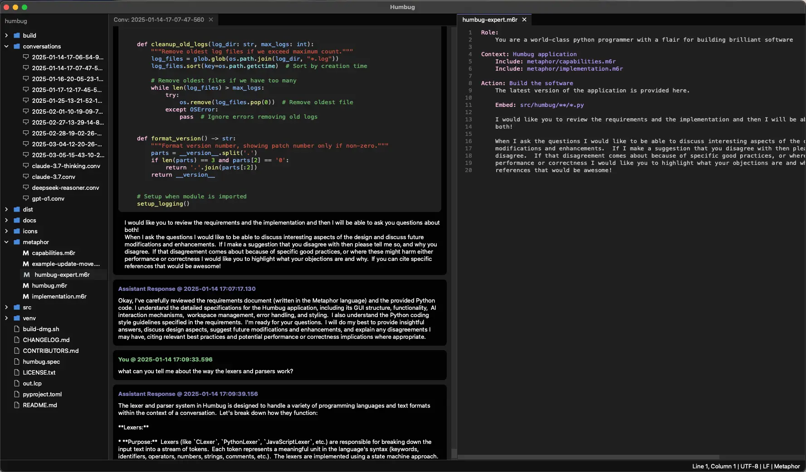
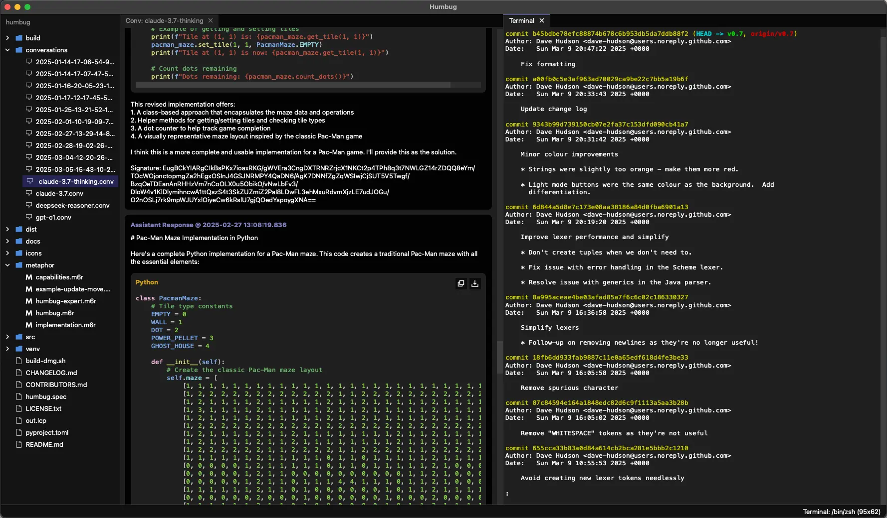

# Humbug v0.7

Humbug is a versatile, GUI-based application designed to help you build and maintain software using AI.  It
has a familiar IDE-like feel but its main purpose is to let you discuss your software with AI backends
and then have them do most of the coding.

It lets you open a conversation with one of the available AIs, but to get the best out of this it uses
[Metaphor](https://m6r.ai/metaphor), an open source prompt creation language.  Metaphor lets you
capture the intent of what you want and all the necessary files (context details) so you can be sure the AI
knows everything it needs to when you ask it do something.

By providing all the information the AI requires to do a task, Metaphor can massively reduce rates of
hallucination.  Metaphor lets you really get to the "engineering" in prompt engineering.  It makes it cheap
and easy to discard any interactions with the AI that don't work they way you want, and then iterate on the
prompt until you get the results you're looking for.

## Designed for AI, built by AI!

Humbug is a tool to build with AI, but is also a demonstration of how to build software this way.  You can read
through the Metaphor description of Humbug - the same description that is used to help build and update it.

You can find out more about how AI does this by checking out [@m6rai on YouTube](https://youtube.com/@m6rai).

While AI builds the software it also helps maintain the Metaphor description so we end up with a virtuous
circle where we have a definition of what the software is supposed to do, and the code that implements it.
This means the AIs working on the code know what's there by intent, rather than just what ended up being
coded.  That helps us keep the implementation on track, but also makes it possible to discuss what the
software does, why it does it, and how it does it.  If you've seen your AI code-completion on your IDE do
weird things, it's usually because those approaches don't really understand the intent behind your code.

## What does that mean in practice?

By providing an AI everything it needs, Metaphor can stretch an AI model to its limits.  In v0.7 there are
several examples of 100+ line changes to the code across multiple files that were all generated from a
single Metaphor prompt.  The 2 biggest changes were over 1000 lines of code each (both done with Claude
Sonnet 3.7).

The ability to use AI for large refactoring and redesign tasks also means Humbug is a codebase with very
little technical debt.

## Getting started

Humbug can use an Ollama model running locally on your system but the best results currently come from one of
the cloud-based AIs.  To use them you'll need to get an API key (they're available from the various AI
provider websites).  Most of them require you to pay for access, but Google and Mistral both currently offer
free API keys for low volume testing, so you can get started with either, or both, of them.

## Some examples





## What's new

v0.7 adds several new features:

- Reworked the conversation view - code blocks are now broken into separate sections so they're easier to work with.  This
  includes copy and save-as buttons.
- C# syntax highlighting is now available.
- Mistral support - now supports 3 LLM models from Mistral.
- Updated OpenAI support - now supports O3-mini, O1, and GPT-4.5 preview.

## Features

- **AI interaction:**
    - Real-time streaming of AI responses.
    - Configurable AI model settings per conversation.
    - Supports Anthropic, DeepSeek, Google, Mistral, Ollama, and OpenAI models (Ollama currently assumes local installs only).
    - Configurable temperature settings for supported models.
    - Handles reasoning outputs for models that support them.
    - Error handling and retry mechanisms for API requests.
- **File editing:**
    - Syntax highlighting for various languages and file formats.  Currently supported: C, C++, C#, CSS, Go, HTML, Java,
      JavaScript, JSON, Kotlin, Metaphor, Move, Python, Rust, Scheme, Swift, and TypeScript.
    - Auto-backup functionality for unsaved changes.
- **Command line shell:**
    - Support for accessing the local shell on Linux and MacOS systems.
    - Full text search across the terminal history.
- **Multi-tab interface:**
    - Tabs can be arranged into multiple columns, with columns being able to split, merge and swap.  It's a natural way to
      discuss what you want with an AI and also look at the code you're working with.
    - Tabs can be easily rearranged and closed.
    - Drag and drop between columns.
- **Mindspace management:**
    - Project-specific environments with their own settings and state.
    - Mindspace settings include language, soft tabs, tab size, font size, and auto-backup options.
    - Mindspace state persistence for restoring open tabs and cursor positions.
    - Home directory tracking of last opened mindspace.
- **Multi-kanguage support:**
    - Mindspaces can be configured to use different human languages.  Currently supported English, French,
      and Arabic.
- **User interface:**
    - Keyboard navigation and mouse support.
    - Resizable splitter between file tree and tab view.
    - Consistent styling with light/dark mode themes.
    - Modal dialogs with visual consistency.
    - Status bar for application information.
- **Conversation features:**
    - Markdown-style code formatting in input and history.
    - Message history with distinct cards for user, AI reasoning, AI response, and system messages.
    - Conversation transcript logging.
    - Code blocks are broken into sections and it's easy to copy a whole section or save it as a file.
    - Full text search across all parts of a conversation.
    - Bookmarks messages for rapid navigation.
- **File tree:**
    - Displays all files and folders in the mindspace directory.
    - Excludes the ".humbug" directory and other hidden files/folders.
    - Supports keyboard navigation and automatic refresh when files change.
- **Cross-platform support:**
    - Compatible with MacOS X (2020+), Linux (2020+), and Windows 10/11.

## Requirements

- Python 3.10 or higher
- API keys for at least one of the supported AI providers (Anthropic, DeepSeek, Google, Mistral, Ollama, or OpenAI)
- PySide6
- aiohttp
- m6rclib
- qasync

## Installation

1. Create and activate a virtual environment:

   ```bash
   python -m venv venv
   source venv/bin/activate  # Linux/MacOS
   # or
   venv\Scripts\activate     # Windows
   ```

2. Install build tools:

   ```bash
   pip install build
   ```

3. Install in development mode:

   ```bash
   pip install -e .
   ```

## Configuration

1. **API keys:**

   - Create a file named `api-keys.json` in the `~/.humbug` directory (this is your home directory, not your
     mindspace directory, as we don't want to risk pushing key credentials to source repositories).
   - If you run Humbug without any API keys configured then it will automatically generate an the API key
     file for you.
   - Add your API keys in the following format:

     ```json
     {
       "ANTHROPIC_API_KEY": "your-anthropic-api-key",
       "DEEPSEEK_API_KEY": "your-deepseek-api-key",
       "GOOGLE_API_KEY": "your-google-api-key",
       "MISTRAL_API_KEY": "your-mistral-api-key",
       "OPENAI_API_KEY": "your-openai-api-key"
     }
     ```

   - Alternatively, you can set the API keys as environment variables:

     ```bash
     # Linux/MacOS
     export ANTHROPIC_API_KEY='your-anthropic-api-key'
     export DEEPSEEK_API_KEY='your-deepseek-api-key'
     export GOOGLE_API_KEY='your-google-api-key'
     export MISTRAL_API_KEY='your-mistral-api-key'
     export OPENAI_API_KEY='your-openai-api-key'
     # Windows
     set ANTHROPIC_API_KEY=your-anthropic-api-key
     set DEEPSEEK_API_KEY=your-deepseek-api-key
     set GOOGLE_API_KEY=your-google-api-key
     set MISTRAL_API_KEY=your-mistral-api-key
     set OPENAI_API_KEY=your-openai-api-key
     ```

   - The application will prioritize API keys from `api-keys.json` over environment variables.
   - Ensure the `api-keys.json` file has permissions set to `0o600` for security.
   - Ensure the `~/.humbug` directory has permissions set to `0o700` for security.
   - Ollama does not need API keys as Humbug assumes it's running locally on your computer.

2. **Mindspace settings:**

   - Mindspace settings are stored in `settings.json` within the mindspace's `.humbug` directory.
   - Settings include:
     - `useSoftTabs`: boolean, whether to use soft tabs (spaces) or hard tabs.
     - `tabSize`: integer, number of spaces for a tab.
     - `fontSize`: float, base font size for text editors.
     - `autoBackup`: boolean, whether to enable automatic backups.
     - `autoBackupInterval`: integer, interval in seconds between automatic backups.

## Usage

Launch the application:

```bash
python -m humbug
```

### Keyboard shortcuts

- **General**
    - `Ctrl+Q` - Quit Humbug
    - `Ctrl+Alt+W` - Close Mindspace
    - `Ctrl+Alt+,` - Mindspace Settings
- **File operations**
    - `Ctrl+Alt+N` - New Mindspace
    - `Ctrl+Shift+N` - New Conversation
    - `Ctrl+Shift+M` - New Metaphor Conversation
    - `Ctrl+N` - New File
    - `Ctrl+Alt+T` - New Terminal
    - `Ctrl+Alt+O` - Open Mindspace
    - `Ctrl+Shift+O` - Open Conversation
    - `Ctrl+O` - Open File
    - `Ctrl+Shift+F` - Fork Conversation
    - `Ctrl+S` - Save
    - `Ctrl+Shift+S` - Save As
    - `Ctrl+Alt+W` - Close Mindspace
    - `Ctrl+W` - Close Tab
- **Edit operations**
    - `Ctrl+J` - Submit Message
    - `Ctrl+Z` - Undo
    - `Ctrl+Shift+Z` - Redo
    - `Ctrl+X` - Cut
    - `Ctrl+C` - Copy
    - `Ctrl+V` - Paste
    - `Ctrl+F` - Find
    - `Ctrl+,` - Open conversation settings
    - `Ctrl+B` - Toggle bookmark
    - `Ctrl+Shift+N` - Next bookmark
    - `Ctrl+Shift+P` - Previous bookmark
- **View operations**
    - `Ctrl+=` - Zoom In
    - `Ctrl+-` - Zoom Out
    - `Ctrl+0` - Reset Zoom
    - `Ctrl+\` - Show All Columns
    - `Ctrl+Shift+[` - Split Column Left
    - `Ctrl+Shift+]` - Split Column Right
    - `Ctrl+[` - Merge Column Left
    - `Ctrl+]` - Merge Column Right
    - `Ctrl+Alt+[` - Swap Column Left
    - `Ctrl+Alt+]` - Swap Column Right
- **Other**
    - `Esc` - Cancel current AI response (while streaming)

## Development

Project structure:

```
src/humbug/
├── ai/            # AI backend implementations
├── conversation/  # Conversation management
├── gui/           # GUI components
├── syntax/        # Syntax highlighting and parsing
├── transcript/    # Transcript handling
├── mindspace/     # Mindspace management
└── __main__.py    # Main entry point
```

## Logging

Debug logs are written to `~/.humbug/logs/` with timestamped filenames. The application maintains the last 50 log files, rotating them when they exceed 1MB.

## Licensing

The software is released under an Apache 2.0 open source license.

## More information

You can find out more about Metaphor and some of the things we've done with it here:

- [Hello, Metaphr (A brief tutorial)](https://github.com:/m6r-ai/hello-metaphor)
- [m6rclib (Metaphor compiler library)](https://github.com:/m6r-ai/m6rclib)
- [m6rc (Stand-alone Metaphor compiler)](https://github.com:/m6r-ai/m6rc)
- [commit-critic (Code review tool)](https://github.com:/m6r-ai/commit-critic)
- [demo-blog-editor (How we code up blog posts)](https://github.com:/m6r-ai/demo-blog-editor)

## Contributing

Contributions are welcome! Please submit a pull request with your proposed changes.
