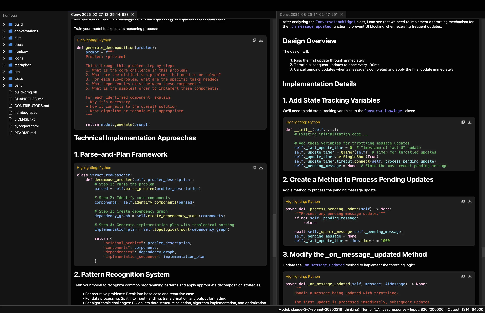
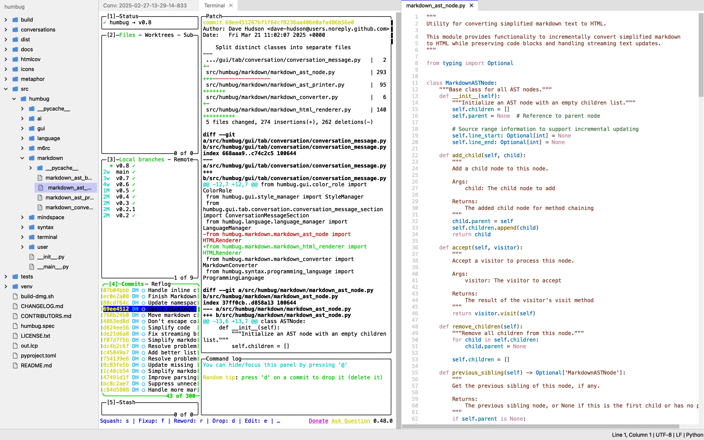
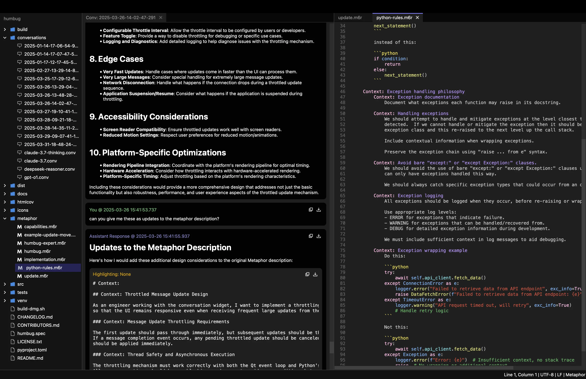
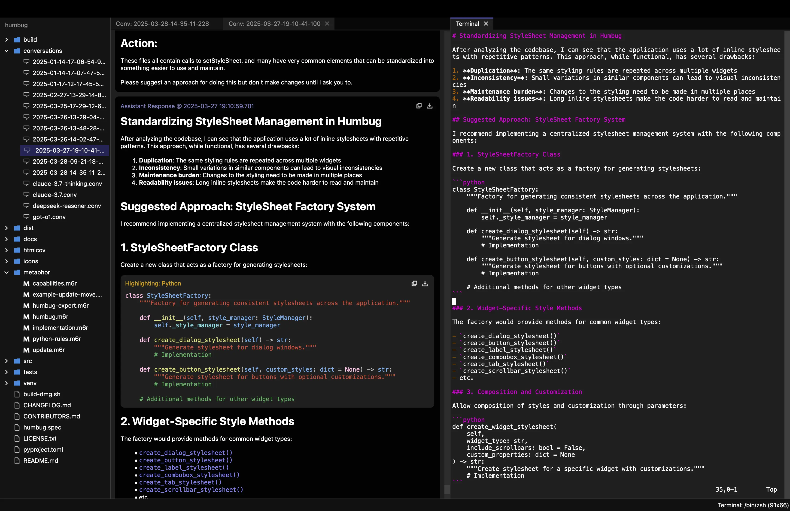

# Humbug v0.10

Humbug is an extensible open-source tool designed to help you build and maintain software using AI.

To do this it uses [Metaphor](https://m6r.ai/metaphor), a simple, open source, natural-language-based prompt creation
language.  Metaphor aims to let you be clear about what you want to achieve so your AI is not left guessing or
hallucinating.

Metaphor scripts are designed to let you capture context in a structured way.  To make this simpler, you can embed
files and explain how you want the AI to use them (source code, requirements docs, design specs, information about
public APIs in libraries, etc).  Metaphor descriptions can also be broken into components so they can be
reused across projects.  For example you might have design or coding rules, UX style guidelines, or implementation
details for how you use specific parts of your tech stack.

By making prompt creation a repeatable engineering process it's easy to try new ideas, and iterate towards what you
want.  If you don't like something, you can make adjustments to your Metaphor scripts and try again.  If you want to
see if a different AI models will give you better results you can do that too!

While Metaphor is designed to help start your conversations with AI, and Humbug is the tool designed to get the most out of
those conversations.  It lets you control and capture any aspect of those conversations and incorporate the results into
your software and documentation.  The built-in editor and terminal also lets you update and test anything you get back from
the AI, and provides you access to any command line tools you might want to use.

Well over 80% of Humbug has been built and maintained by AI using Metaphor (the Metaphor files are in the repo), so
it demonstrates how effective this approach can be.









## What does that mean in practice?

Providing an AI everything it needs lets Metaphor stretch an AI model way beyond code completions.  In most versions
there have been many 100+ line changes to the code across multiple files that were all generated from
single Metaphor prompts.  The biggest changes have been well over 1000 lines of code each.

The ability to use AI for large refactoring and redesign tasks also means Humbug is a codebase that can
evolve very fast but with very little technical debt.

One fun aspect of using Metaphor is we can use Humbug to become an expert on its own design.  If you use the
Metaphor script `humbug-expert.m6r` and run this with a model that has a very large context window (e.g. Gemini)
then you can ask the AI anything about the design or implementation of the software!

## Engineering over vibes!

Vibe coding can be a great way to experiment and try out ideas but can be incredibly frustrating for experienced
engineers.  Vibe coding can be an incredible way to support prototyping and brainstorming, but high quality code requires
careful review and understanding.

By offering a solid grounding context, Metaphor and Humbug aim to provide a way to capture the learnings from
vibe coding into something that can be used in a more predictable way.  We can start from our reference context,
explore interactively, update the context and iterate.  We can go further than normal vibe coding because we can also
have conversations with the AI about what it doesn't understand, or what else it might need.  All that feedback
can be used to refine the Metaphor context.

## What's new in v0.10

v0.10 is primarily changing details behinds the scenes so there are only a few user-visible differences.

One user-visible difference is when restoring a mindspace the active tabs and any columns are now
restored too, but the first time you do this they will not be restored from a v0.9 (or earlier) saved state.

Humbug now supports xAI's Grok-3 models.

The major changes in v0.10 are that the codebase is now thoroughly type-checked using `mypy`, while other issues
are now thoroughly checked using `pylint`.  In both cases the code is running with zero errors or warnings.

Please see the `CHANGELOG.md` file for full details.

## Features

### Cross-platform support

Compatible with MacOS X, Linux, and Windows 10/11.

### AI interaction

- Real-time streaming of AI responses.
- Configurable AI model settings per conversation.
- Supports Anthropic, DeepSeek, Google, Mistral, Ollama, OpenAI, and xAI models (Ollama currently assumes local installs only).
- Configurable temperature settings for supported models.
- Handles reasoning outputs for models that support them.
- Error handling and retry mechanisms for API requests.

### Conversation features

- Markdown-style code formatting in input and history.
- Message history with distinct cards for user, AI reasoning, AI response, and system messages.
- Code blocks are broken into sections and it's easy to copy a whole section or save it as a file.
- Copy or save whole messages as Markdown.
- Full text search across all parts of a conversation.
- Bookmarks messages for rapid navigation.
- Syntax highlighting for various languages and file formats, including nested systax highlighting where code for
  one language appears inside a different one.  Currently supported: C, C++, C#, CSS, Go, HTML, Java,
  JavaScript, JSON, Kotlin, Markdown, Metaphor, Move, Python, Rust, Scheme, Swift, and TypeScript.

### File editing

- Full file editing with syntax highlighting.
- Auto-backup functionality for unsaved changes.

### Terminal emulator

- Support for accessing the local shells/command prompts (Unix shells, or Windows command prompt).
- Full text search across the terminal history.

### Multi-tab interface

- Tabs can be arranged into multiple columns, with columns being able to split, merge and swap.  It's a natural way to
  discuss what you want with an AI and also look at the code you're working with.
- Tabs can be easily rearranged and closed.
- Drag and drop between columns.

### Mindspace management

- Project-specific environments with their own settings and state.
- Mindspace settings include language, soft tabs, tab size, font size, and auto-backup options.
- Mindspace state persistence for restoring open tabs and cursor positions.
- Home directory tracking of last opened mindspace.

### Multi-language support

- Humbug can be configured to use different human languages.  Currently supported English, French,
  and Arabic.

## Getting started

Humbug can use an Ollama model running locally on your system but the best results currently come from one of
the cloud-based AIs.  To use them you'll need to get an API key (they're available from the various AI
provider websites).  Most of them require you to pay for access, but Google and Mistral both currently offer
free API keys for low volume testing, so you can get started with either, or both, of them.

## Requirements

- Python 3.10 or higher
- You will need API keys for any AI models other than Ollama
- PySide6 (the GUI framework)
- qasync (allows the GUI framework to work nicely with async Python code)
- aiohttp (async HTTP client)
- certifi (SSL/TLS root certificates to allow TLS network connections without any other system changes)

## Installation

1. Create and activate a virtual environment:

   ```bash
   python -m venv venv
   source venv/bin/activate  # Linux/MacOS
   # or
   venv\Scripts\activate     # Windows
   ```

2. Install build tools:

   ```bash
   pip install build
   ```

3. Install in development mode:

   ```bash
   pip install -e .
   ```

## Initial configuration

The main configuration you require is to set up your API keys for whichever AI services you wish to use.
As of v0.8 you can do this by opening the "User Settings" dialog on the Humbug menu.

Ollama does not need API keys as Humbug assumes it's running locally on your computer.

## Usage

Launch the application:

```bash
python -m humbug
```

## Development

Project structure:

```
src/humbug/
├── ai/            # AI backend and conversation implementations
├── gui/           # GUI components
├── language/      # I18n management and strings
├── m6rc/          # Metaphor compiler
├── markdown/      # Markdown parser
├── mindspace/     # Mindspace management
├── syntax/        # Syntax highlighting and parsing
├── terminal/      # Terminal emulation
├── user/          # User settings management
└── __main__.py    # Main entry point
```

## Logging

Debug logs are written to `~/.humbug/logs/` with timestamped filenames. The application maintains the last 50 log files, rotating them when they exceed 1MB.
Please note this is in your home directory, not the `.humbug` directory that you get in a mindspace.

## Licensing

The software is released under an Apache 2.0 open source license.

## Find out more on YouTube

You can find out more about Humbug and Metaphor on YouTube: [@m6rai on YouTube](https://youtube.com/@m6rai).

## Join us on Discord

If you want to engage with other users and developers, you can join us on [Discord](https://discord.gg/GZhJ7ZtgwN).

## More information

You can find out more about Metaphor and some of the things we've done with it here:

- [Hello, Metaphor (A brief tutorial)](https://github.com:/m6r-ai/hello-metaphor)
- [m6rclib (Metaphor compiler library)](https://github.com:/m6r-ai/m6rclib)
- [m6rc (Stand-alone Metaphor compiler)](https://github.com:/m6r-ai/m6rc)
- [commit-critic (Code review tool)](https://github.com:/m6r-ai/commit-critic)
- [demo-blog-editor (How we code up blog posts)](https://github.com:/m6r-ai/demo-blog-editor)

## Commercial support

Humbug and Metaphor are supported by M6R Ltd.  To find out more please head over to [m6r.ai](https://m6r.ai)

## Contributing

Contributions are welcome! Please submit a pull request with your proposed changes.
