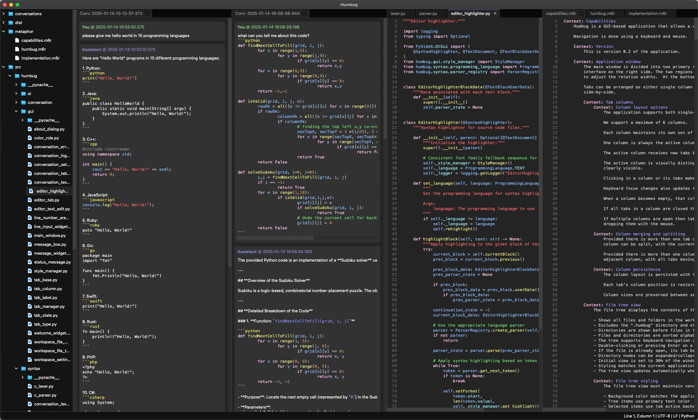
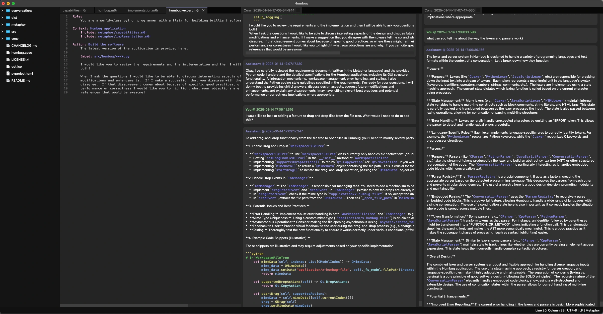

# Humbug v0.4

Humbug is a versatile, GUI-based application designed to place AI interactions at the heart of software
product development.  It offers a user-friendly tabbed interface for managing simultaneous conversations
with different AIs, and editing files, all while maintaining a consistent user experience across Linux,
Windows and MacOS.

## Designed for AI, built by AI!

The application is designed to support building things using AI, but is itself largely built by AI.  It uses
an approach of providing a very large amount of context to an AI backend about the intent behind the
application.  This is done using a [Metaphor](https://m6r.ai/metaphor) description of the application and
some elements of its implementation.  It includes a Metaphor prompt compiler as one option for starting a
conversation with an AI backend.

You can find out more about how AI does this by checking out [@m6rai on YouTube](https://youtube.com/@m6rai).

While AI builds the software it also helps maintain the Metaphor description so we end up with a virtuous
circle where we have a definition of what the software is supposed to do, and the code that implements it.
This means the AIs working on the code know what's there by intent, rather than just what ended up being
coded.  That helps us keep the implementation on track, but also makes it possible to discuss what the
software does, why it does it, and how it does it.

Here's Humbug in action with multiple conversations ongoing while also editing files.



This time we're using the Metaphor file `metaphor/humbug-expert.m6r` to create a couple of conversations
that are expert on Humbug itself!



## Features

- **Multi-Tab Interface:**
    - Supports multiple concurrent conversations with AI backends.
    - Allows for editing of text files with syntax highlighting.
    - Tabs can be arranged into multiple columns, with columns being able to split and merge.
    - Tabs can be easily rearranged and closed.
    - Drag and drop between columns.
- **AI Interaction:**
    - Real-time streaming of AI responses.
    - Configurable AI model settings per conversation.
    - Supports OpenAI, Google Gemini, Anthropic, and Ollama models (Ollama currently assumes local installs only).
    - Configurable temperature settings for supported models.
    - Error handling and retry mechanisms for API requests.
- **File Editing:**
    - Syntax highlighting for various languages.  Currently supported: C, C++, CSS, HTML, JavaScript,
      JSON, Kotlin, Metaphor, Move, Python, Scheme, and TypeScript.
    - Auto-backup functionality for unsaved changes.
- **Mindspace Management:**
    - Project-specific environments with their own settings and state.
    - Mindspace settings include language, soft tabs, tab size, font size, and auto-backup options.
    - Mindspace state persistence for restoring open tabs and cursor positions.
    - Home directory tracking of last opened mindspace.
- **Multi-Language Support:**
    - Mindspaces can be configured to use different human languages.  Currently supported English, French,
      and Arabic.
- **User Interface:**
    - Keyboard navigation and mouse support.
    - Resizable splitter between file tree and tab view.
    - Consistent styling with light/dark mode themes.
    - Modal dialogs with visual consistency.
    - Status bar for application information.
- **Conversation Features:**
    - Markdown-style code formatting in input and history.
    - Message history with distinct cards for user, AI, and system messages.
    - Input area that expands vertically as content is added.
    - Full vertical scrollbar for history and input area.
    - Conversation transcript logging.
    - Full text search across all parts of a conversation.
- **File Tree:**
    - Displays all files and folders in the mindspace directory.
    - Excludes the ".humbug" directory and other hidden files/folders.
    - Supports keyboard navigation and automatic refresh when files change.
- **Menu System:**
    - Top-level menus for Humbug, File, Edit, and View.
    - Keyboard shortcuts for all menu items.
    - Dynamic menu item state updates based on application context.
- **Cross-Platform Support:**
    - Compatible with MacOS X (2020+), Linux (2020+), and Windows 10/11.
- **Asynchronous Design:**
    - Utilizes asynchronous operations to ensure responsiveness.

## Requirements

- Python 3.10 or higher
- API keys for at least one of the supported AI providers (OpenAI, Google, Anthropic)
- PySide6
- aiohttp
- m6rclib
- qasync

## Installation

1. Create and activate a virtual environment:

   ```bash
   python -m venv venv
   source venv/bin/activate  # Linux/MacOS
   # or
   venv\Scripts\activate     # Windows
   ```

2. Install build tools:

   ```bash
   pip install build
   ```

3. Install in development mode:

   ```bash
   pip install -e .
   ```

## Configuration

1. **API Keys:**

   - Create a file named `api-keys.json` in the `~/.humbug` directory (this is your home directory, not your
     mindspace directory, as we don't want to risk pushing key credentials to source repositories).
   - Add your API keys in the following format:

     ```json
     {
       "OPENAI_API_KEY": "your-openai-api-key",
       "GOOGLE_API_KEY": "your-google-api-key",
       "ANTHROPIC_API_KEY": "your-anthropic-api-key"
     }
     ```

   - Alternatively, you can set the API keys as environment variables:

     ```bash
     export OPENAI_API_KEY='your-openai-api-key'  # Linux/MacOS
     export GOOGLE_API_KEY='your-google-api-key'
     export ANTHROPIC_API_KEY='your-anthropic-api-key'
     # or
     set OPENAI_API_KEY=your-openai-api-key       # Windows
     set GOOGLE_API_KEY=your-google-api-key
     set ANTHROPIC_API_KEY=your-anthropic-api-key
     ```

   - The application will prioritize API keys from `api-keys.json` over environment variables.
   - Ensure the `api-keys.json` file has permissions set to `0o600` for security.
   - Ensure the `~/.humbug` directory has permissions set to `0o700` for security.

2. **Mindspace Settings:**

   - Mindspace settings are stored in `settings.json` within the mindspace's `.humbug` directory.
   - Settings include:
     - `useSoftTabs`: boolean, whether to use soft tabs (spaces) or hard tabs.
     - `tabSize`: integer, number of spaces for a tab.
     - `fontSize`: float, base font size for text editors.
     - `autoBackup`: boolean, whether to enable automatic backups.
     - `autoBackupInterval`: integer, interval in seconds between automatic backups.

## Usage

Launch the application:

```bash
python -m humbug
```

### Keyboard Shortcuts

- **General**
    - `Ctrl+Q` - Quit Humbug
    - `Ctrl+Alt+N` - New Mindspace
    - `Ctrl+Alt+O` - Open Mindspace
    - `Ctrl+Alt+W` - Close Mindspace
    - `Ctrl+Alt+,` - Mindspace Settings
- **File Operations**
    - `Ctrl+N` - New File
    - `Ctrl+O` - Open File
    - `Ctrl+Shift+N` - New Conversation
    - `Ctrl+Shift+O` - Open Conversation
    - `Ctrl+Shift+M` - New Metaphor Conversation
    - `Ctrl+S` - Save
    - `Ctrl+Shift+S` - Save As
    - `Ctrl+W` - Close Tab
    - `Ctrl+Shift+F` - Fork Conversation
- **Edit Operations**
    - `Ctrl+J` - Submit Message
    - `Ctrl+Z` - Undo
    - `Ctrl+Shift+Z` - Redo
    - `Ctrl+X` - Cut
    - `Ctrl+C` - Copy
    - `Ctrl+V` - Paste
    - `Ctrl+,` - Open conversation settings
- **View Operations**
    - `Ctrl+=` - Zoom In
    - `Ctrl+-` - Zoom Out
    - `Ctrl+0` - Reset Zoom
    - 'Ctrl+\' - Show All Columns
    - 'Ctrl+Shift+[' - Split Column Left
    - 'Ctrl+Shift+]' - Split Column Right
    - 'Ctrl+[' - Merge Column Left
    - 'Ctrl+]' - Merge Column Right
- **Other**
    - `Esc` - Cancel current AI response

## Development

Project structure:

```
src/humbug/
├── ai/            # AI backend implementations
├── conversation/  # Conversation management
├── gui/           # GUI components
├── syntax/        # Syntax highlighting and parsing
├── transcript/    # Transcript handling
├── mindspace/     # Mindspace management
└── __main__.py    # Main entry point
```

## Logging

Debug logs are written to `~/.humbug/logs/` with timestamped filenames. The application maintains the last 50 log files, rotating them when they exceed 1MB.

## Licensing

The software is released under an Apache 2.0 open source license.

## More Information

You can find out more about Metaphor and some of the things we've done with it here:

- [Hello, Metaphr (A brief tutorial)](https://github.com:/m6r-ai/hello-metaphor)
- [m6rclib (Metaphor compiler library)](https://github.com:/m6r-ai/m6rclib)
- [m6rc (Stand-alone Metaphor compiler)](https://github.com:/m6r-ai/m6rc)
- [commit-critic (Code review tool)](https://github.com:/m6r-ai/commit-critic)
- [demo-blog-editor (How we code up blog posts)](https://github.com:/m6r-ai/demo-blog-editor)

## Contributing

Contributions are welcome! Please submit a pull request with your proposed changes.
