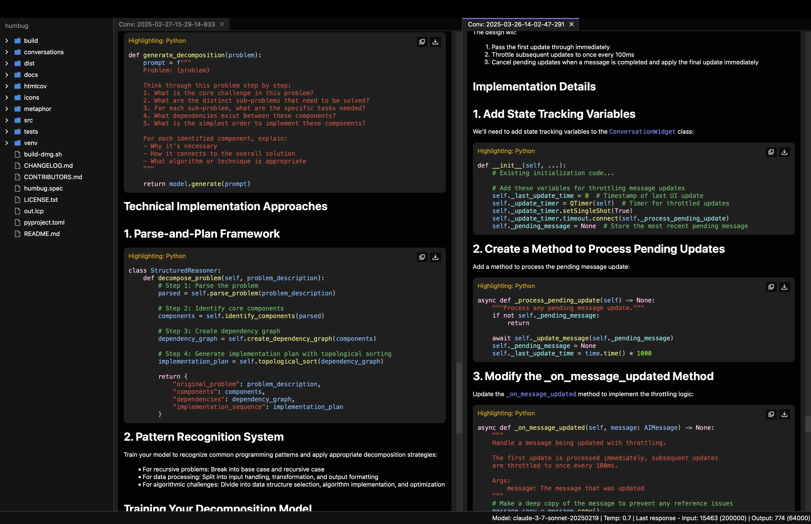
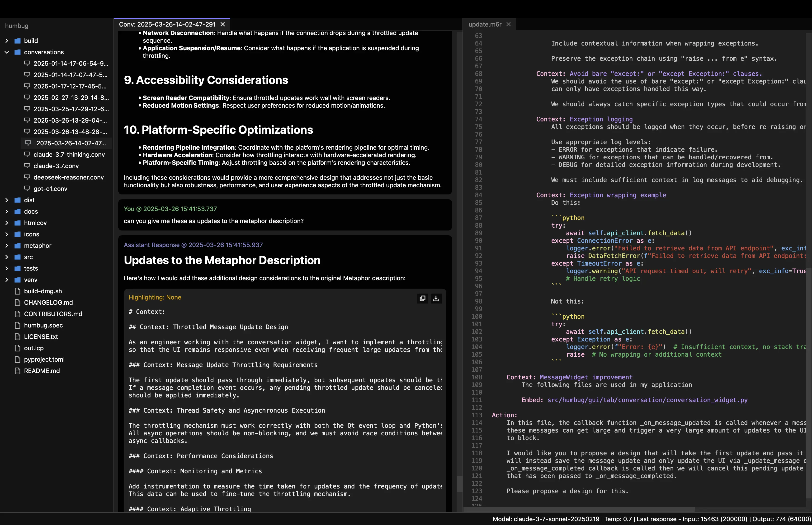

# Humbug v0.9

Humbug is an extensible open-source tool designed to help you build and maintain software using AI.  It goes beyond
AI-powered app builders and IDEs by helping you capture what you want your software to do so AI can keep helping you
long after the initial prototyping stage.

To do this it uses [Metaphor](https://m6r.ai/metaphor), a simple, open source, prompt creation
language.  Metaphor lets you capture what you want your software to do and all the information (context)
an AI will need to help you develop and support that software throughout its lifecycle.

Metaphor lets you get to the "engineering" in prompt engineering.  It helps massively increase the work that
can be done by AI, and significantly reduces rates of hallucination by ensuring the AI doesn't have to guess
what you want to build.

Humbug uses a familiar IDE-style environment but it's built to have AI at its core.  You can discuss your software,
seek recommendations, get help designing and coding new and complex capabilities, or use it to understand and
navigate what you have.

## Designed for AI, built by AI!

Humbug is a tool to build with AI, but is also a demonstration of how to build software this way.  You can read
through the Metaphor description of Humbug - the same description that is used to help build and update it.

You can find out more about how AI does this by checking out [@m6rai on YouTube](https://youtube.com/@m6rai).

While AI builds the software it also helps maintain the Metaphor description so we end up with a virtuous
circle where we have a definition of what the software is supposed to do, and the code that implements it.
This means the AIs working on the code know what's there by intent, rather than just what ended up being
coded.  That helps us keep the implementation on track, but also makes it possible to discuss what the
software does, why it does it, and how it does it.  If you've seen your AI code-completion on your IDE do
weird things, it's usually because those approaches don't really understand the intent behind your code.

## What does that mean in practice?

By providing an AI everything it needs, Metaphor can stretch an AI model to its limits.  In most versions
there have been examples of 100+ line changes to the code across multiple files that were all generated from a
single Metaphor prompt.  The biggest changes have been well over 1000 lines of code each (both done with Claude
Sonnet 3.7).

The ability to use AI for large refactoring and redesign tasks also means Humbug is a codebase that can
evolve very fast but with very little technical debt.

## What this isn't!

While Humbug has a lot of the characteristics of a normal IDE, it's not intended to be a clone of a conventional
IDE.  AIs can do many things far more quickly than people so we want to lean on AIs to do those things.

Over time you will see many more AI-backed capabilities.  Manual features will increasingly just be a
fallback.

## Getting started

Humbug can use an Ollama model running locally on your system but the best results currently come from one of
the cloud-based AIs.  To use them you'll need to get an API key (they're available from the various AI
provider websites).  Most of them require you to pay for access, but Google and Mistral both currently offer
free API keys for low volume testing, so you can get started with either, or both, of them.

## Join the community on Discord

If you want to engage with other users and developers, you can join us on [Discord](https://discord.gg/GZhJ7ZtgwN).

## What's new

v0.9 adds several new features:

- The current focus message is now highlighted across all conversations.  You can now step between
  messages in the current conversation using "Alt+Up" and "Alt+Down".
- You can now both copy to the clipboard, or save, whole messages in Markdown format, as well as copying or
  saving code blocks within messages.
- Block-level Markdown syntax highlighting is now supported.

## Some examples






## Features

### AI interaction

- Real-time streaming of AI responses.
- Configurable AI model settings per conversation.
- Supports Anthropic, DeepSeek, Google, Mistral, Ollama, and OpenAI models (Ollama currently assumes local installs only).
- Configurable temperature settings for supported models.
- Handles reasoning outputs for models that support them.
- Error handling and retry mechanisms for API requests.

### File editing

- Syntax highlighting for various languages and file formats.  Currently supported: C, C++, C#, CSS, Go, HTML, Java,
  JavaScript, JSON, Kotlin, Metaphor, Move, Python, Rust, Scheme, Swift, and TypeScript.
- Auto-backup functionality for unsaved changes.

### Command line shell

- Support for accessing the local shell on Linux and MacOS systems.
- Full text search across the terminal history.

### Multi-tab interface

- Tabs can be arranged into multiple columns, with columns being able to split, merge and swap.  It's a natural way to
  discuss what you want with an AI and also look at the code you're working with.
- Tabs can be easily rearranged and closed.
- Drag and drop between columns.

### Mindspace management

- Project-specific environments with their own settings and state.
- Mindspace settings include language, soft tabs, tab size, font size, and auto-backup options.
- Mindspace state persistence for restoring open tabs and cursor positions.
- Home directory tracking of last opened mindspace.

### Multi-kanguage support

- Mindspaces can be configured to use different human languages.  Currently supported English, French,
  and Arabic.

### User interface

- Keyboard navigation and mouse support.
- Resizable splitters between file tree and tab columns.
- Consistent styling with light/dark mode themes.
- Status bar for application information.

### Conversation features

- Markdown-style code formatting in input and history.
- Message history with distinct cards for user, AI reasoning, AI response, and system messages.
- Code blocks are broken into sections and it's easy to copy a whole section or save it as a file.
- Full text search across all parts of a conversation.
- Bookmarks messages for rapid navigation.

### File tree

- Displays all files and folders in the mindspace directory.
- Excludes the ".humbug" directory and other hidden files/folders.
- Supports keyboard navigation and automatic refresh when files change.

### Cross-platform support

Compatible with MacOS X (2020+), Linux (2020+), and Windows 10/11.

## Requirements

- Python 3.10 or higher
- API keys for at least one of the supported AI providers (Anthropic, DeepSeek, Google, Mistral, Ollama, or OpenAI)
- PySide6 (the GUI framework)
- qasync (allows the GUI framework to work nicely with async Python code)
- aiohttp (async HTTP client)
- certifi (SSL/TLS root certificates to allow TLS network connections without any other system changes)

## Installation

1. Create and activate a virtual environment:

   ```bash
   python -m venv venv
   source venv/bin/activate  # Linux/MacOS
   # or
   venv\Scripts\activate     # Windows
   ```

2. Install build tools:

   ```bash
   pip install build
   ```

3. Install in development mode:

   ```bash
   pip install -e .
   ```

## Initial configuration

The main configuration you require is to set up your API keys for whichever AI services you wish to use.
As of v0.8 you can do this by opening the "User Settings" dialog on the Humbug menu.

Ollama does not need API keys as Humbug assumes it's running locally on your computer.

## Usage

Launch the application:

```bash
python -m humbug
```

## Development

Project structure:

```
src/humbug/
├── ai/            # AI backend and conversation implementations
├── gui/           # GUI components
├── language/      # I18n management and strings
├── m6rc/          # Metaphor compiler
├── markdown/      # Markdown parser
├── mindspace/     # Mindspace management
├── syntax/        # Syntax highlighting and parsing
├── terminal/      # Terminal emulation
├── user/          # User settings management
└── __main__.py    # Main entry point
```

## Logging

Debug logs are written to `~/.humbug/logs/` with timestamped filenames. The application maintains the last 50 log files, rotating them when they exceed 1MB.
Please note this is in your home directory, not the `.humbug` directory that you get in a mindspace.

## Licensing

The software is released under an Apache 2.0 open source license.

## More information

You can find out more about Metaphor and some of the things we've done with it here:

- [Hello, Metaphr (A brief tutorial)](https://github.com:/m6r-ai/hello-metaphor)
- [m6rclib (Metaphor compiler library)](https://github.com:/m6r-ai/m6rclib)
- [m6rc (Stand-alone Metaphor compiler)](https://github.com:/m6r-ai/m6rc)
- [commit-critic (Code review tool)](https://github.com:/m6r-ai/commit-critic)
- [demo-blog-editor (How we code up blog posts)](https://github.com:/m6r-ai/demo-blog-editor)

## Contributing

Contributions are welcome! Please submit a pull request with your proposed changes.
